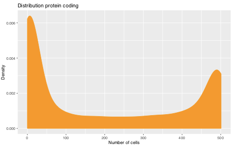
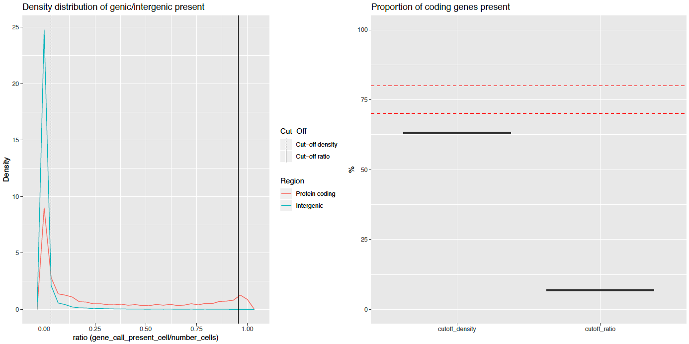

# Bgee: Single Cell RNA-Seq data analysis pipeline

**General information:**

1. [Introduction](#introduction)
2. [Step 1: Data annotation](#step-1-data-annotation)
3. [Step 2: Verification, data download and preparation of info file](#step-2-verification-data-download-and-preparation-of-info-file)
   1. [Verification: metadata from source and quantity of cells](#verification-metadata-from-source-and-quantity-of-cells)
   2. [Data download](#data-download)
   3. [Preparation of informative file](#preparation-of-informative-file)
   
4. [Step 3: scRNA-Seq library analyses](#step-3-scrna-seq-library-analyses)
   1. [Data preparation](#data-preparation)
   2. [Pseudo-alignment](#pseudo-alignment)
   3. [Quality control for cell population](#quality-control-for-cell-population)  
   4. [Result processing at individual cell](#result-processing-at-individual-cell)
   5. [Result processing at cell population](#result-processing-at-cell-population)
   6. [Post-processing: expression calls and rank computation](#post-processing-expression-calls-and-rank-computation)

**Detailed guidelines:**

1. [Preparation steps](#preparation-steps)
2. [Mapping the libraries](#mapping-the-libraries)
3. [Validate cell-type and experiment](#validate-cell-type-and-experiment)
4. [Export global information per cell population ](#export-global-information-per-cell-population )
5. [Presence calls](#presence-calls)
  

## General information:

### Introduction

scRNA-Seq data are used in Bgee to produce:

* baseline calls of presence of expression
* ranking of these baseline calls to identify the most important conditions with expression, for each gene
* calls of differential over-/under-expression

These results are then integrated in a consistent manner with all other results from other data types, to produce global calls of expression, and to compute gene expression ranks for calls of expression.

### Step 1: Data annotation

For scRNA-Seq we manualy annotated healthy WT data using information from GEO or from papers, or provided by WormBase. The annotation of each cell-type is done by using the scientific information provided by these sources.
All the data treated are present in the SRA repository. 
The protocols selected at present are only full-length protocols, mainly `SMART-Seq`, `SMART-Seq2` and `SMARTer Ultra Low`.

### Step 2: Verification, data download and preparation of info file

#### Verification: metadata from source and quantity of cells

After the annotation process, where each library corresponds to an individual cell, we verify if the Bgee annotations are in concordance with repository metadata from where we download the data. If they are not, we save this information in metadata_notMatch.txt and do not further use these libraries.
In the next step we validate experiments based on a minimum quantity of cells (100) per cell-type in each experiment and species.

#### Data download

The download of the data is done only for the experiments that match the requirements in the previous steps.
These data are downloaded from SRA using the wget function in R. All files extracted are FASTQ files.

GTF annotation files and genome sequence fasta files are retrieved from Ensembl and Ensembl metazoa for all species included in Bgee (see `RNA-Seq pipeline`). 
This information is used to identify sequences of genic regions, exonic regions, and intergenic regions, as described in the `RNA-Seq pipeline`. It is also used to generate indexed transcriptome files for all species in Bgee, using the `TopHat` and `Kallisto` software.

#### Preparation of information file

An information file is created by collecting information from the manual annotation and from the first quality control step using `FASTP` software for each FASTQ file, which correspond to each individual cell. 

### Step 3: scRNA-Seq library analyses

For each independent library, we do:

#### Data preparation

* Check for presence of single-end FASTQ read file, or of the two FASTQ files for paired-end runs.
* Estimation of read length, by using the mean of all reads of FASTQ file determined by `FASTP`, in order to check which K-mer length should be applied.
* If the reads are less than 31 bp they are too short for Kallisto indexing with default k-mer length, and the k-mer length is set to 15 nucleotides. 
* A FASTP file is generated for each FASTQ file to check for potential problems; it also provide information about possible trimmed samples.

#### Pseudo-alignment

The following parameters are used:

* No bootstrapping
* K-mer length for indexing: see `RNA-Seq pipeline`
* For single-end libraries, we provide as default fragment length 180 bp, with a sd of 20bp.
* For paired-end libraries, Kallisto can estimate the fragment length and sd, so we do not provide this information.

#### Quality control for cell population

* For each cell-type population we compute the ratio of how many times a gene is detected across the number of cells with a simple threshold (TPM > 0).
* Verify if the cell-type population follow a bimodal distribution, i.e. most genes are either present in almost all cells, or absent in almost all cells.

#### Result processing at individual cell

From the Kallisto output, for each genomic feature, counts of pseudo-aligned reads are retrieved.
The pseudo-aligned read counts, and the genomic feature effective lengths, are used to compute TPM and FPKM values. 
We sum at the gene level the counts of pseudo-aligned reads computed at the transcript level by Kallisto.
For calling genes present (see `Expression Calls`), we compute not only for genic regions, but also for intergenic regions.

#### Result processing at cell population

* Sum calls

Computation of the ratio for each gene that belongs to the same cell-type population per experiment and species. At this step we use simple TPM>0 calls, more elaborate calls are computed later in the pipeline.

Bgee also provide information about the cut-off values applied to call genes as present for the cell-type population.

* Sum raw counts

From the Kallisto output, for each cell-type population that belongs to same experiment and species the counts of pseudo-aligned reads are retrieved and summed, and the effective length are recalculated based on the weighted mean.
The pseudo-aligned summed read counts, and the genomic feature weighted mean effective lengths, are used to compute TPM and FPKM values. 
We sum at the gene level the counts of pseudo-aligned reads computed at the transcript level by Kallisto.

#### Post-processing: expression calls and rank computation

##### Expression calls

* Per individual cell

To define the call of expression of a gene in a library as "present", we check whether its level of expression is over the background transcriptional noise in this library. To estimate the background transcriptional noise in each library, we use the level of expression of a set of intergenic regions (described in the RNA-Seq pipeline). 
How we define this set of intergenic regions is described in the developer documentation section of RNA-Seq pipeline.

* Per cell population

To define the call of expression of a gene in a cell population as "present", we compute the density ratio. We compute 2 cut-offs: "proportion" (proportion intergenic/proportion coding = 0.05) and "density" (density ratio where the density of intergenic region is lower then the density of protein coding). A gene is classified as present with high confidence if its expression is above the "proportion" cut-off, and with low confidence if it is below that but above the "density" cut-off. SARA PLEASE CHECK THIS.

##### Rank computation

To calculate the ranks of expression of genes per cell type we use the TPM values at cell population level (output file from the Sum Raw Counts).

## Detailed guidelines:

### Preparation steps

The preparation step is done by executing 4 main R scripts available in the folder [0Preparation/](0Preparation/)

* [pre_process_control_annotation.R](#pre-process-control-annotation-R)
   * Remove experiments that not pass requirement of minimum number of cells.
   
* [retrieve_metadata.R](#retrive-metadata-R)
   * Retrieve metadata of the libraries that need to be downloaded.

* [download_cleaning_data.R](#download-cleaning-data-R)
   * Download all data annotated with minimum requirements.
   
* [prepare_scrna_seq_sample_info.R](#prepare-scrna-seq-sample-info-R)
   * Create an info file about all libraries by collecting information from manual annotation and FASTP software

### Mapping and analysis of the libraries

To run the mapping for each library a R script from the folder [1Run/](1Run/) should be executed:

* [kallisto_analysis.R](#kallisto-analysis-R)
   * The first step of this script runs the pseudo-alignment for each individual library.
   * The second step performs the analysis where the transcripts are summed to gene level and the TPM and FPKM recalculated, more details can be founded in the RNA-Seq pipeline for this second step.

In this step note that there is a folder that was generated from the RNA-Seq pipeline for each species with the following information:
   * transcriptome index (15 k-mer and 31 k-mer)
   * gene2transcript file
   * gene2biotype file

### Validate cell-type and experiment

In order to validate if an experiment should be integrated in Bgee, a validation createria is applied by using a quality control script in [1Run/QC_cellPopulation.R](1Run/QC_cellPopulation.R).
The criteria is to verify if a cell-type from an experiment and species follow a bimodal distribution.
For this we quantify how many times the TPM value is higher then zero for each gene that belongs to biotype protein coding across the number of the cells and then calculate the ratio. After that a R `package LaplacesDemon` is applied to determine if the ratio distribution is indeed bimodal. 

### Export global information per cell population 

* Sum of raw counts

In order to provide to the user a global information per cell-type, experiment, and species we provide a abundance file with sum of est_counts from kallisto for each transcript, followed by the weight mean of effective length across all cells and then the recalculation of TPM and FPKM. The information in the end is reported at gene level.
This is done using the script: [1Run/Sum_RawCounts_cellPopulation.R](1Run/Sum_RawCounts_cellPopulation.R).

### Presence calls

In this step of the pipeline to call present genes (note that in single cell RNA-Seq data we don't call absent genes) we use the reference intergenic regions from the RNA-Seq pipeline. This comes from the fact that the density of deconvolute intergenic regions are tendencialy less noisy, as is showed in the graphics below, where the summed by species using just single cell data or by pulling all libraries together, this means RNA-Seq and scRNA-Seq, provide a more high overlap between intergenic and coding regions.

* Per cell

In order to call present genes using the intergenic regions the script [1Run/scRNAseq_Callpresent.R](1Run/scRNAseq_Callpresent.R) should be executed.
After call expressed genes for each individual cell, the output is exported with information about present genes in each library, as well as, is collected a global information about each library in the file `All_samples.tsv`. In order to summarize the information in a visual way a global plot with the distribution of proportion of coding present is exported, as represented below for each species.
We should have in consideration, that because of high propotion of zeros in single cell RNA-Seq data, exist a proportional effect in the proportion of protein coding genes called present.

* Per cell-type population

In order to provide a call of expressed genes at cell-type population level, we introduze an approach based on the aggregation of the calls, by executing the following code [1Run/Sum_Calls_cellPopulation.R](1Run/Sum_Calls_cellPopulation.R).
The confidente approach at population level allow us to call expressed genes based in two criteria: threshold ratio cut-off based on the proportion of intergenic and coding regions and the second criteria is the density, this means the cut-off is applied when the density of intergenic regions is lower than the coding regions, as demonstrated in the graphic below.

Based on this approach we are able to call "high confident" expressed genes at population level (all genes at the right of the threshold ratio cut-off) and "low confident" expressed genes (all genes between the density cut-off and threshold ratio cut-off).

At the population level a `Sum_Calls` file is exported for each cell-type population, as well as, the graphic plot with referent cut-offs.
In order to summarize all information from all different cell types, experiments and species a `Stats_SumFile.tsv` file is exported collecting all important information, as well as, the graphic plots of all cells and species present in the annotation file, as represented below.

